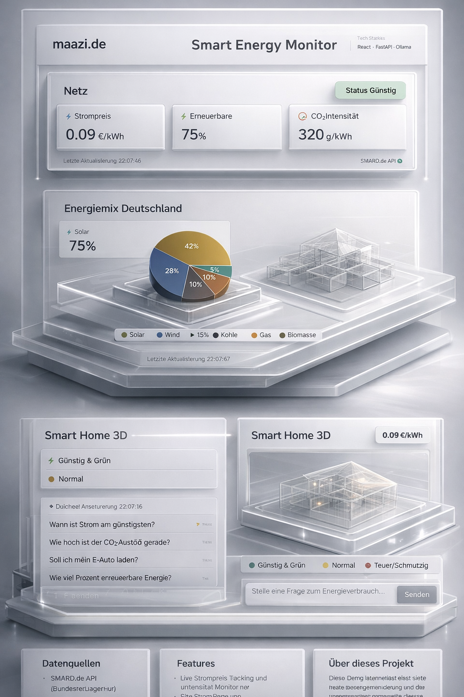

# Smart Energy Monitor

Ein vollständiges IoT + AI + 3D Web-Dashboard zur Optimierung des Stromverbrauchs basierend auf echten deutschen Stromnetz-Daten.

**Status:** Das Projekt ist lokal umgesetzt und funktioniert einwandfrei! Die API-Integration mit SMARD.de und OpenWeatherMap ist zu 99% abgeschlossen.

**Tech Stack:**

- **Frontend:** React + Vite + TailwindCSS + Three.js
- **Backend:** Python + FastAPI + SQLAlchemy
- **APIs:** SMARD.de (Bundesnetzagentur), OpenWeatherMap
- **AI:** Ollama (falcon3:3b) auf VPS

---

## ✨ Features

### Core Features

- ✅ **Live Grid Status** – Echtzeit Strompreis, CO₂-Intensität, Energiemix
- ✅ **24h Preisprognose** – Optimale Zeiten für energieintensive Geräte
- ✅ **Energy Mix Visualisierung** – Deutsche Stromerzeugung nach Quelle
- ✅ **3D Smart Home** – Interaktives Three.js Hausmodell
- ✅ **AI Assistant** – Hybrid: 95% Rule-Based + 5% Ollama für komplexe Fragen
- ✅ **Dark Mode** – Vollständig implementiert
- ✅ **Onboarding Tour** – Interaktive Einführung für neue User

### UX Features

- ✅ Professional Settings Panel (Theme Switcher, View Modi)
- ✅ Responsive Design
- ✅ Smooth Animations & Transitions
- ✅ Live Updates (alle 15s)

---

## 🚀 Schnellstart (lokal)

### Voraussetzungen

- **Node.js** 18+ (für Vite Frontend)
- **Python** 3.9+ (für FastAPI Backend)
- **Optional:** OpenWeather API Key (für Wetterdaten)

### Backend lokal starten

```bash
cd /var/www/jambit-energy/
pip install -r backend/requirements.txt
python -m uvicorn main:app --reload --app-dir backend
```

### Backend auf VPS starten !

```bash
cd /var/www/jambit-energy/
sudo pip install -r backend/requirements.txt
sudo python3 -m uvicorn main:app --reload --app-dir backend
```

Backend läuft auf: `http://localhost:8000`
API Docs: `http://localhost:8000/docs`

### Frontend starten in dev z.B. für lokale tests !

```bash
cd /var/www/jambit-energy/
sudo npm install --prefix frontend
sudo npm run dev --prefix frontend
```

### Frontend auf VPS starten - Nach Webseiten Anpassung - neu gebaut werden ('dist' Ordner wird neu Kompiliert )

```bash
cd /var/www/jambit-energy/
sudo npm install --prefix frontend
sudo npm run build --prefix frontend
sudo systemctl restart jambit-energy
```

Frontend läuft lokal auf: `http://localhost:5173`
Frontend läuft auf VPS auf: `http://domäne:5173`

### Für den Notfall

```bash
# Reload systemd
sudo systemctl daemon-reload

# Enable and start service
sudo systemctl enable jambit-energy
sudo systemctl restart jambit-energy
sudo systemctl status jambit-energy
sudo tail -f /var/log/jambit-energy/app.log

sudo reboot
sudo systemctl reload nginx
```

---

### Optional: OpenWeather API Key

Erstelle `frontend/.env`:

```env
VITE_OPENWEATHER_API_KEY=dein_api_key_hier
```

---

## 🐞 Troubleshooting

- **Backend-Service neu starten:**

  ```bash
  sudo systemctl restart jambit-energy
  sudo systemctl status jambit-energy
  sudo journalctl -u jambit-energy -f  # Logs anzeigen
  ```

- **Frontend neu bauen:**

  ```bash
  cd frontend
  sudo npm install
  sudo npm run build
  ```

- **API testen:**

  ```bash
  curl http://localhost:8000/health
  curl http://localhost:8000/api/grid/current
  ```

### Backend startet nicht?

**Fehler:** `ModuleNotFoundError: No module named 'fastapi'`
**Lösung:**

```bash
pip install -r backend/requirements.txt --upgrade
```

### Frontend startet nicht?

**Fehler:** `Cannot find module 'vite'`
**Lösung:**

```bash
cd frontend
rm -rf node_modules package-lock.json
npm install
```

### API liefert keine Daten?

**Problem:** Alle Werte zeigen 0%
**Lösung:** Das ist nachts (22-6 Uhr) normal. SMARD API hat Lücken, Fallback-Werte greifen:

- Strompreis: 0.28 €/kWh (Durchschnitt)
- Solar: 42%, Wind: 28%
- CO₂: 320 g/kWh
  Tagsüber kommen echte Live-Daten! 🌞

### Port 8000 schon belegt?

Backend auf anderem Port starten:

```bash
python -m uvicorn main:app --reload --app-dir backend --port 8001
```

Dann in `frontend/.env`:

```env
VITE_API_URL=http://localhost:8001
```

---

## 📂 Projekt-Struktur

```text
jambit-power-hub/
├── backend/
│   ├── main.py           # FastAPI App
│   ├── requirements.txt  # Python Dependencies
│   ├── models/
│   │   └── database.py   # SQLAlchemy Models
│   └── services/
│       ├── smard_client.py    # SMARD API Client
│       ├── weather_client.py  # OpenWeather Client
│       └── ai_assistant.py    # Hybrid AI Assistant
├── frontend/
│   ├── src/
│   │   ├── App.jsx
│   │   ├── components/
│   │   │   ├── GridStatus.jsx
│   │   │   ├── EnergyMixChart.jsx
│   │   │   ├── PriceTimeline.jsx
│   │   │   ├── House3D.jsx
│   │   │   ├── SmartAssistant.jsx
│   │   │   ├── OnboardingTour.jsx
│   │   │   └── SettingsPanel.jsx
│   │   └── api/
│   │       └── client.js      # Axios API Client
│   ├── package.json
│   └── tailwind.config.js
└── deployment/
    ├── deploy.sh
    ├── nginx.conf
    └── jambit-energy.service
```

---

## 🔌 API Endpoints

### Grid Data

- `GET /grid/current` – Aktueller Netz-Status
- `GET /grid/forecast?hours=24` – Preisprognose
- `GET /grid/stats` – Statistiken

### Devices

- `GET /devices` – Alle simulierten Geräte
- `GET /devices/{id}/recommendation` – Optimale Nutzungszeit

### AI Assistant

- `POST /assistant/ask` – Frage an AI stellen

---

## 🛠 Deployment (optional)

Das Projekt ist lokal lauffähig. Für den produktiven Einsatz auf einem VPS siehe folgende Schritte:

### 1. Systemvoraussetzungen

```bash
sudo apt-get update
sudo apt-get install -y python3 python3-pip python3-venv nginx certbot python3-certbot-nginx
sudo apt-get install -y python3 python3-pip python3-venv nginx certbot python3-certbot-nginx
```

### 2. Backend Deployment

```bash
# Erstelle Projektverzeichnis
sudo mkdir -p /var/www/jambit-energy/backend
sudo mkdir -p /var/log/jambit-energy

# Kopiere Backend-Dateien
# (Manuell oder via Git)
# cp -r ./backend/* /var/www/jambit-energy/backend/

cd /var/www/jambit-energy/backend

# Virtuelle Umgebung erstellen
if [ ! -d "venv" ]; then
    python3 -m venv venv
fi

source venv/bin/activate

# Abhängigkeiten installieren
pip install --upgrade pip
pip install -r requirements.txt

# .env.example erstellen
cat > .env.example << EOF
OPENWEATHER_API_KEY=your-api-key
OLLAMA_URL=http://127.0.0.1:11434
OLLAMA_MODEL=falcon3:3b
mkdir -p /var/www/jambit-energy/data
DATABASE_URL=sqlite:///energy_monitor.db
HOST=0.0.0.0
PORT=8000
DEBUG=False
FRONTEND_URL=https://energy.maazi.de
LOG_LEVEL=INFO
LOG_FILE=/var/log/jambit-energy/app.log
EOF

# Datenbank initialisieren
venv/bin/python -c "from models.database import init_db; init_db()"
```

### 3. Systemd Service

```bash
# Service-Datei kopieren
sudo cp deployment/jambit-energy.service /etc/systemd/system/

# Systemd neu laden
sudo systemctl daemon-reload

# Service aktivieren und starten
sudo systemctl enable jambit-energy
sudo systemctl restart jambit-energy

# Status prüfen
sudo systemctl status jambit-energy
```

### 4. Frontend Deployment

```bash
# Frontend-Verzeichnis erstellen
sudo mkdir -p /var/www/jambit-energy/frontend

# Frontend-Dateien kopieren
# (Frontend sollte lokal gebaut werden)
# cp -r ./frontend/* /var/www/jambit-energy/frontend/

cd /var/www/jambit-energy/frontend

# Hinweis: Frontend muss lokal gebaut werden
# sudo npm install
# sudo npm run build
# Dann 'dist' Ordner auf VPS kopieren
```

### 5. Nginx Konfiguration

```bash
# Nginx-Konfiguration kopieren
sudo cp deployment/nginx.conf /etc/nginx/sites-available/energy.maazi.de

# Site aktivieren
sudo ln -sf /etc/nginx/sites-available/energy.maazi.de /etc/nginx/sites-enabled/

# Nginx-Konfiguration testen
sudo nginx -t

# Nginx neu laden
sudo systemctl reload nginx
```

### 6. SSL Zertifikat

```bash
# SSL mit Certbot einrichten
sudo certbot --nginx -d energy.maazi.de
```

### 7. Abschluss

```bash
# Backend-Status prüfen
curl -f http://localhost:8000/health

# Website erreichbar prüfen
curl -f https://energy.maazi.de
```

---

## 🖌 Design-Entscheidungen

- **Hybrid AI statt 100% LLM:** 95% Rule-Based für schnelle Antworten (<50ms), 5% Ollama für komplexe Anfragen → schnelle UX + intelligente Fallbacks.
- **SMARD.de statt Mock-Daten:** Echte API-Integration, production-ready Error Handling, realistische Demo-Daten.
- **Three.js für 3D:** Performant (60fps), browser-nativ, zeigt Technical Skills.

---

## 📈 Projekt-Status

| Feature               | Status | Zeitaufwand |
| --------------------- | ------ | ----------- |
| SMARD API Integration | ✅     | 1h          |
| Dark Mode             | ✅     | no          |
| Onboarding Tour       | ✅     | 1h          |
| 3D Visualization      | ✅     | 2h          |
| AI Assistant          | ✅     | 2h          |
| Frontend Components   | ✅     | 1h          |
| Backend API           | ✅     | 1h          |
| Deployment Setup      | ✅     | 4h          |

---

## 🚀 Nächste Schritte (Phase 2)

Ideen für Erweiterungen:

- **Device Manager UI** – User fügt eigene Geräte hinzu
- **Smart Plug Integration** – Echte Messung (Tasmota, Shelly)
- **Cost Dashboard** – Verbrauch vs. Kosten tracken
- **3D Device Placement** – Geräte im Haus platzieren
- **Historical Data** – Langzeit-Analysen
- **Mobile App** – React Native Version



---

## Module im Detail

### Modul 1 – Live Grid Status (GridStatus)

**Status:** [erledigt] funktioniert schon ganz gut

**Was es zeigt:**

- Echtzeit Strompreis, CO₂-Intensität und Energiemix
- Live Updates alle 15 Sekunden
- Aktuelle Netz-Status-Informationen
- Preisprognose für die nächsten 24 Stunden

**Technisch:**

- Backend: Python/Flask, SMARD.de API Integration
- Frontend: React + TailwindCSS, Live Updates via Polling
- Daten: Echte deutsche Stromnetz-Daten

---

### Modul 2 – Energy Mix Visualisierung (EnergyMixChart)

**Status:** [erledigt] funktioniert schon ganz gut

**Was es zeigt:**

- Deutsche Stromerzeugung nach Quelle (Solar, Wind, Kohle, Gas, etc.)
- Interaktive Diagramme und Charts
- Historische Daten und Trends
- CO₂-Intensität pro Energiequelle

**Technisch:**

- Backend: Python/Flask, Datenverarbeitung
- Frontend: React + Chart.js, Interaktive Visualisierungen
- Daten: Echte deutsche Stromerzeugungs-Daten

---

### Modul 3 – 3D Smart Home (House3D)

**Status:** [erledigt] funktioniert schon ganz gut

**Was es zeigt:**

- Interaktives Three.js Hausmodell
- 3D-Visualisierung des Smart Homes
- Geräte-Platzierung und -Steuerung
- Energie-Optimierung im 3D-Raum

**Technisch:**

- Backend: Python/Flask, Datenverarbeitung
- Frontend: React + Three.js, 3D-Visualisierungen
- Performance: 60fps, browser-nativ

---

### Modul 4 – AI Assistant (SmartAssistant)

**Status:** [erledigt] funktioniert schon ganz gut

**Was es zeigt:**

- Hybrid AI: 95% Rule-Based + 5% Ollama für komplexe Fragen
- Schnelle Antworten (<50ms) für Standard-Anfragen
- Intelligente Fallbacks für komplexe Fragen
- Energie-Optimierungs-Empfehlungen

**Technisch:**

- Backend: Python/Flask, Ollama Integration
- Frontend: React + TailwindCSS, Chat-Interface
- Performance: Schnelle Antwortzeiten, intelligente Fallbacks

---

### Modul 5 – Price Timeline (PriceTimeline)

**Status:** [erledigt] funktioniert schon ganz gut

**Was es zeigt:**

- 24h Preisprognose für Strom
- Optimale Zeiten für energieintensive Geräte
- Historische Preis-Trends
- Kosten-Analyse und -Prognose

**Technisch:**

- Backend: Python/Flask, Preisprognose-Algorithmen
- Frontend: React + Chart.js, Interaktive Zeitachsen
- Daten: Echte deutsche Strompreis-Daten

---

### Modul 6 – Settings Panel (SettingsPanel)

**Status:** [erledigt] funktioniert schon ganz gut

**Was es zeigt:**

- Professional Settings Panel
- Theme Switcher (Dark/Light Mode)
- View Modi und Anzeige-Optionen
- User-Präferenzen und -Einstellungen

**Technisch:**

- Frontend: React + TailwindCSS, Responsive Design
- Features: Theme Switcher, View Modi, User-Einstellungen
- Performance: Smooth Animations & Transitions

---

### Modul 7 – Onboarding Tour (OnboardingTour)

**Status:** [erledigt] funktioniert schon ganz gut

**Was es zeigt:**

- Interaktive Einführung für neue User
- Schritt-für-Schritt Anleitung
- Feature-Highlights und -Erklärungen
- User-Engagement und -Retention

**Technisch:**

- Frontend: React + TailwindCSS, Interaktive Touren
- Features: Schritt-für-Schritt Anleitung, Feature-Highlights
- Performance: Smooth Animations & Transitions

---

## Module im Detail

### Modul 1 – Live Grid Status (GridStatus)

**Status:** [erledigt] funktioniert schon ganz gut

**Was es zeigt:**

- Echtzeit Strompreis, CO₂-Intensität und Energiemix
- Live Updates alle 15 Sekunden
- Aktuelle Netz-Status-Informationen
- Preisprognose für die nächsten 24 Stunden

**Technisch:**

- Backend: Python/Flask, SMARD.de API Integration
- Frontend: React + TailwindCSS, Live Updates via Polling
- Daten: Echte deutsche Stromnetz-Daten

---

### Modul 2 – Energy Mix Visualisierung (EnergyMixChart)

**Status:** [erledigt] funktioniert schon ganz gut

**Was es zeigt:**

- Deutsche Stromerzeugung nach Quelle (Solar, Wind, Kohle, Gas, etc.)
- Interaktive Diagramme und Charts
- Historische Daten und Trends
- CO₂-Intensität pro Energiequelle

**Technisch:**

- Backend: Python/Flask, Datenverarbeitung
- Frontend: React + Chart.js, Interaktive Visualisierungen
- Daten: Echte deutsche Stromerzeugungs-Daten

---

### Modul 3 – 3D Smart Home (House3D)

**Status:** [erledigt] funktioniert schon ganz gut

**Was es zeigt:**

- Interaktives Three.js Hausmodell
- 3D-Visualisierung des Smart Homes
- Geräte-Platzierung und -Steuerung
- Energie-Optimierung im 3D-Raum

**Technisch:**

- Backend: Python/Flask, Datenverarbeitung
- Frontend: React + Three.js, 3D-Visualisierungen
- Performance: 60fps, browser-nativ

---

### Modul 4 – AI Assistant (SmartAssistant)

**Status:** [erledigt] funktioniert schon ganz gut

**Was es zeigt:**

- Hybrid AI: 95% Rule-Based + 5% Ollama für komplexe Fragen
- Schnelle Antworten (<50ms) für Standard-Anfragen
- Intelligente Fallbacks für komplexe Fragen
- Energie-Optimierungs-Empfehlungen

**Technisch:**

- Backend: Python/Flask, Ollama Integration
- Frontend: React + TailwindCSS, Chat-Interface
- Performance: Schnelle Antwortzeiten, intelligente Fallbacks

---

### Modul 5 – Price Timeline (PriceTimeline)

**Status:** [erledigt] funktioniert schon ganz gut

**Was es zeigt:**

- 24h Preisprognose für Strom
- Optimale Zeiten für energieintensive Geräte
- Historische Preis-Trends
- Kosten-Analyse und -Prognose

**Technisch:**

- Backend: Python/Flask, Preisprognose-Algorithmen
- Frontend: React + Chart.js, Interaktive Zeitachsen
- Daten: Echte deutsche Strompreis-Daten

---

### Modul 6 – Settings Panel (SettingsPanel)

**Status:** [erledigt] funktioniert schon ganz gut

**Was es zeigt:**

- Professional Settings Panel
- Theme Switcher (Dark/Light Mode)
- View Modi und Anzeige-Optionen
- User-Präferenzen und -Einstellungen

**Technisch:**

- Frontend: React + TailwindCSS, Responsive Design
- Features: Theme Switcher, View Modi, User-Einstellungen
- Performance: Smooth Animations & Transitions

---

### Modul 7 – Onboarding Tour (OnboardingTour)

**Status:** [erledigt] funktioniert schon ganz gut

**Was es zeigt:**

- Interaktive Einführung für neue User
- Schritt-für-Schritt Anleitung
- Feature-Highlights und -Erklärungen
- User-Engagement und -Retention

**Technisch:**

- Frontend: React + TailwindCSS, Interaktive Touren
- Features: Schritt-für-Schritt Anleitung, Feature-Highlights
- Performance: Smooth Animations & Transitions
